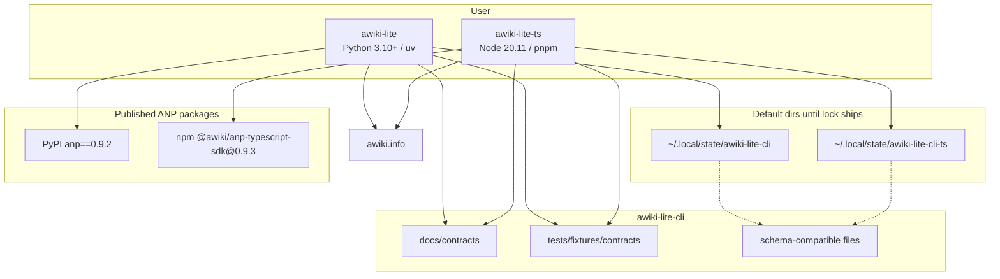
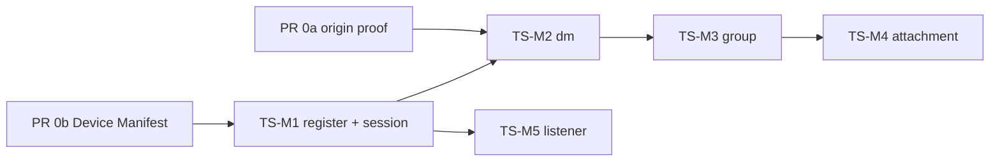

# AWiki Lite CLI 双语言并行方案（Python + TypeScript）

> 2026-08-19 交互方案取消：Python 和 TypeScript 是两个独立实现，各自使用
> 独立状态目录。跨运行时文件锁、共享状态、双进程交互、PKCS#8 跨语言向量及
> 对应 PR 阶段均已取消。本文后续相关内容只保留为历史记录，不得据此恢复代码、
> 测试或 CI；现行规则以 `AGENTS.md`、`README.md` 和
> `docs/contracts/local-state-v1.md` 为准。

> 2026-08-18 实施更新：本文中早期的 `register` / `dm` / `attachment` /
> `session` / `listener` 命令示例保留为历史设计记录。当前 Python 和
> TypeScript 的权威公开语法以 `docs/contracts/cli-ux-v0.2.md` 为准，
> 顶层分组统一为 `id` / `msg` / `group` / `runtime`。
>
> 2026-08-18 依赖更新：ANP TypeScript SDK 已发布为 npm
> `@awiki/anp-typescript-sdk@0.9.3`。本文后面出现的 sibling checkout、
> `file:../../anp/anp/typescript/ts_sdk`、手动构建 SDK 和 ANP SHA 固定方式仅是
> 发布前的历史计划，已经被正式 npm 依赖取代。当前安装与 CI 不需要相邻 ANP 仓库。

| 字段 | 值 |
|---|---|
| 文档标题 | AWiki Lite CLI TypeScript 并行实现设计 |
| 作者 | TBD |
| 日期 | 2026-08-15 |
| 修订 | 2026-08-15 r4（用户拍板：README 英文正文 + TS 安装节；锁测试变绿后默认目录切回 `awiki-lite-cli`） |
| 状态 | Ready for implementation |
| 适用范围 | 现有 Python CLI 继续作为一等实现；新增独立 TypeScript CLI，两者并行支持 |
| 目标仓库 | `/home/ecs-user/awiki-space/awiki-lite-cli` |
| 权威 ANP TS SDK | npm `@awiki/anp-typescript-sdk@0.9.3`（精确版本，由 `pnpm-lock.yaml` 校验完整性） |
| 本文性质 | 只设计，不实现 |

---

## Overview

当前 `awiki-lite-cli` 只有 Python 实现（包版本 `0.2.0`，入口 `awiki-lite`）。本方案在**不迁移、不改写、不削弱**现有 Python 客户端的前提下，新增一个一等 TypeScript 实现，使用 ANP TypeScript SDK 完成 DID / W3C proof / RFC 9421 origin proof / HTTP Message Signature，而不是另写协议客户端。

两个实现共享同一套 wire contract、同一套命令面（命令名、flag、退出码、脱敏规则）和同一套**本地状态 schema**。TypeScript 侧**不得**复用 TS SDK 高层 `createAwikiImClient()` 作为架构内核。

**默认数据目录在跨运行时锁落地之前隔离。** TS 默认使用 `platformdirs` 语义下的 `awiki-lite-cli-ts`（Linux：`~/.local/state/awiki-lite-cli-ts`），避免 Node 标准库无法取得 Python `fcntl.flock` / `msvcrt.locking` 时拆裂 `pending-send.json`。schema、PKCS#8 与 `AWIKI_LITE_STATE_DIR` 显式共享仍按同一规范实现；把默认目录改回与 Python 相同，必须等 `interop-lock` job（`fs-ext.flock(fd, "ex")` 双向）变绿。

---

## Background & Motivation

### 当前 Python 状态

仓库仍是单语言 `src` layout，依赖方向是 `commands → application → domain`，`infrastructure` 实现 ports。这是已经落地并远程验收过的产品面，而不仅是上次 commit：

| 层级 | 关键路径 | 职责 |
|---|---|---|
| 入口 | `src/awiki_lite_cli/cli.py`，`pyproject.toml` `[project.scripts] awiki-lite` | Typer 装配 |
| 命令 | `commands/{identity,direct,groups,attachments,session,listener}.py` | 参数、TTY、退出码、渲染；**部分命令直接编排**（见 §3） |
| 用例 | `application/{registration,groups,attachments,ports,errors}.py` | 注册/群/附件编排。**没有** `application/messaging.py` |
| 值对象 | `domain/{models,validation}.py` | 无 I/O 的 DID/消息/群/附件模型 |
| 适配器 | `infrastructure/{anp_sdk,user_service,message_service,group_service,attachment_service,rpc,state,listener,listener_service,safe_network}.py` | ANP、JSON-RPC、状态、WS、SSRF |

命令面（以 README 与 `cli.py` 为准，含尚未进入 v0.2 plan 台账但已存在的 listener / session）：

```text
awiki-lite register [--handle] [--phone]
awiki-lite dm send <DID> [TEXT] [--stdin]
awiki-lite dm inbox [--limit] [--skip] [--mark-read]
awiki-lite dm history <DID> [--limit] [--skip]
awiki-lite group create|list|info|members|add|send|messages
awiki-lite attachment send|download
awiki-lite session refresh
awiki-lite listener run|install|start|stop|restart|status|uninstall
```

Python 依赖：PyPI `anp==0.9.2`、`typer`、`httpx`、`platformdirs`、`cryptography`、`websockets`。身份生成走 `anp.authentication.create_did_wba_document` + `build_vnext_did_document` + `DeviceManifestEntry` + `generate_w3c_proof`；消息签名走 `anp.proof.generate_rfc9421_origin_proof`；会话刷新走 `anp.authentication.generate_http_signature_headers`。`AGENTS.md` 明确禁止在本仓库重写 ANP 已提供的身份 / proof / 密码学。

仓库**今天没有** `.github/` CI。`docs/plan/v1-architecture.md` 只规划了“同时 checkout ANP 匹配 revision”，该 workflow 从未落地。双语言 CI 必须从零编写，不能“挂在现有 Python job 上”。

### 痛点

1. 只有 Python 运行时，Node/TS 工具链无法在同一契约下维护一个可安装的 Lite 客户端。
2. 相邻产品 `dsh-awiki` 已经 vendoring 了一份 TS SDK，那是插件专用快照，不能当作 Lite CLI 的协议源。
3. 若用 `createAwikiImClient()` 包一层 CLI，会得到另一套身份、OTP、明文状态，且缺少 group create / listener。

### 为何现在做

Python v0.1 注册/私聊与 v0.2 群/附件已经有冻结契约和脱敏 fixtures。TypeScript 可以按同一契约平行实现。

---

## Goals & Non-Goals

### Goals

1. Python CLI 保持可安装、可测试、可发布；现有 `uv run awiki-lite`、pytest、Ruff、mypy、`uv build`（**只打** `src/awiki_lite_cli` wheel）路径不变。
2. 新增一等 TypeScript CLI，Node 20.11+，使用**权威** ANP TypeScript SDK。
3. 两个实现并行支持：同一仓库、独立包、独立 CI job、可同时安装。
4. 命令名、位置参数、kebab-case flag、退出码（成功 `0` / 输入 `2` / 业务或远端 `1`）、环境变量、脱敏规则与 Python 对齐。
5. 本地状态 **schema** 兼容（同一文件布局、同一口令 PKCS#8、同一 pending 语义）。默认目录在锁互操作落地前隔离；`AWIKI_LITE_STATE_DIR` 显式共享是测试与锁就绪后的产品路径。
6. 功能目标是覆盖**当前 Python 表面**，按里程碑分阶段。

### Non-Goals

- 不把 Python 改写成 TS，不做共享 FFI/WASM 运行时。允许一个**很小**的可选 native addon（`fs-ext` 或自研 N-API）**只**用于 flock，不把协议/身份放进 native。
- 不在 Lite CLI 内重实现 Device Manifest、JCS、RFC 9421 origin proof 签名基、HTTP Message Signature、W3C Data Integrity。缺的能力回推官方 ANP TS SDK。
- 不把 `createAwikiImClient()` / `AwikiImStateStore` / 任何 `im/*` 模块当作 Lite 架构或生产依赖。
- 不把 CLI 里对 `proof.im.generateImProof` 的薄封装当作 origin proof 生产路径。
- 不做 E2EE、MLS、多设备、身份恢复、Keychain、可靠同步投影、TUI、邮件、插件、Handle lookup。
- 不把 `dsh-awiki/vendor/anp-typescript-sdk` 当作依赖源。
- 不在首个 TS 里程碑要求全量对等。
- 不为双语言搬迁现有 Python 目录。`tests/fixtures/contracts` 留在仓库根，保证 TS 相对路径 `../../tests/fixtures/contracts` 长期有效。

---

## Key Decisions

| 决策 | 选择 | 理由 |
|---|---|---|
| 仓库布局 | **单仓，Python 留在仓库根；新增 `typescript/`** | 最小扰动。`uv build` 继续只打 Python wheel。不引入根级 npm workspace。 |
| 包与二进制 | Python `awiki-lite`；TS `@awiki/lite-cli`，bin **`awiki-lite-ts`** | 同名会互相覆盖 PATH。 |
| 契约所有权 | **`docs/contracts/` + `tests/fixtures/contracts/`**；新增 `cli-ux-v0.2.md` 与 `local-state-v1.md`，**作为独立必合 PR，不可并入脚手架** | UX/状态今天只在 Python 代码里；没有书面契约，PR 3 会发明另一套 schema。 |
| TS 运行时 | **Node `20.11`，pnpm 9（`packageManager` 钉死），ESM，strict + `noUncheckedIndexedAccess`，Commander 12，Vitest，ESLint 9 + `@typescript-eslint` + Prettier** | 与 SDK `engines.node >= 20` 对齐；pnpm 从 npm 自动安装 SDK。 |
| 口令输入 | **`@inquirer/password`，必须 TTY** | 不用 `\x1B[8m` + readline（仍可能回显/被记入终端）。禁止 `--passphrase` 与环境变量。 |
| HTTP | 原生 `fetch` + **显式依赖 `undici`**（自定义 CA Dispatcher） | Node 内置 undici 版本漂移；`AWIKI_LITE_CA_BUNDLE` 要有冒烟测试。 |
| ANP TS SDK | **精确依赖 `@awiki/anp-typescript-sdk@0.9.3`** | npm 包已包含编译后的 ESM、CommonJS 和类型声明；锁文件固定完整性校验值。 |
| 高层 IM client | **不用；禁止 import `im/*`** | Legacy 身份/OTP/明文状态/无 Manifest。 |
| Origin proof 生产路径 | **只调用 SDK 公开的 `generateRfc9421OriginProof`（PR 0a）** | 禁止 CLI 组装 signature base 或封装 `generateImProof`。 |
| 分层 | **镜像依赖方向，不假装 Python `dm` 已有 application 层** | TS **可以**新增 `application/direct.ts`。commands 可以像 Python 一样直接构造 infrastructure。 |
| 功能对等 | TS-M1 身份/session → M2 dm → M3 group → M4 attachment；**M5 listener 可在 M1 之后并行** | listener 只依赖 session + WS，不依赖附件。 |
| 默认状态目录 | **M1：隔离 `awiki-lite-cli-ts`。`interop-lock` 变绿后，独立 PR 把 TS 默认 `appname` 改回 `awiki-lite-cli`（与 Python 相同）。M1 之前不得共享默认目录。** | 用户 2026-08-15 拍板。锁未证前并行会拆裂 pending；证后不应永久隔离。`AWIKI_LITE_STATE_DIR` 始终可显式共享。 |
| README | **保留现有英文正文；增加 TypeScript 安装 / 命令示例节（短双语可）。不整篇中英对照，不另建 `README.zh.md`。** | 用户 2026-08-15 拍板。 |
| 跨运行时锁 | **两端都调用 `fs-ext.flock(fd, "ex")`**。空 `.lock` 先写 `\0` 并 `fsync`。Windows 上 stock `fs-ext` 锁 ~4GiB（`LK_LEN`），与 Python 首字节 CRT 锁重叠即互斥；仅当 `interop-lock` job 失败才写 length=1 的 N-API | 见 §8.4。不改 Python 锁协议（H.2 为备选）。 |
| Client header | **TS 始终发送 `awiki-cli/0714/0.2.0`，不从 npm semver 推导** | 当前 Python 与 fixtures 的值。`awiki.info` allow-list 未在本环境核实；M1 远程注册前必须用该冻结串探测。 |
| SDK 缺口 | **拆成 sibling PR 0a（origin proof 移植）+ 0b（Device Manifest 移植）** | 不是“导出已有函数”。Python origin 模块 299 行；Manifest 946 行 + `testdata/device_manifest/`。 |
| 发布 | **path-only 直到 M2 远程 E2E；公开 npm `0.1.0` = M2；`0.2.0` 仅当 M4 附件落地** | 消除 §6 / Q3 / PR 5 的三套说法。 |
| 口令策略 | **最短 12 且非空白** | `state.py` `_validate_passphrase`；不是“只拒绝空白”。 |
| CI | **从零写两个独立 job**；TS job 先构建 SDK `dist/` | 仓库无 `.github/`。Python job 永不 `needs` TS。 |

---

## Proposed Design

### 1. 仓库布局

```text
awiki-lite-cli/                          # 仓库根，Python 一等实现保持不动
├── .github/workflows/ci.yml             # 新增：Python job + TS job，互不 needs
├── .gitignore                           # 增补 typescript/node_modules/、typescript/dist/
├── AGENTS.md                            # 扩展为双语言门禁
├── README.md                            # 两种安装与命令示例
├── pyproject.toml                       # awiki-lite-cli 0.2.x；Hatch 仍只打包 src/awiki_lite_cli
├── uv.lock
├── src/awiki_lite_cli/                  # 现有 Python
├── tests/                               # Python 测试；fixtures 被 TS 只读引用
│   └── fixtures/contracts/              # 不搬动
├── scripts/
├── docs/
│   ├── contracts/
│   │   ├── v0.1-wire-contract.md
│   │   ├── v0.2-group-attachment-wire-contract.md
│   │   ├── cli-ux-v0.2.md              # PR 2 必合
│   │   └── local-state-v1.md           # PR 2 必合
│   └── plan/
│       └── ts-parallel.md
└── typescript/
    ├── package.json                     # packageManager: pnpm@9.x
    ├── pnpm-lock.yaml
    ├── tsconfig.json
    ├── eslint.config.js
    ├── vitest.config.ts
    ├── src/
    ├── tests/
    └── scripts/
        └── remote-e2e.ts
```

不引入根级 npm/pnpm workspace。`ruff check .` 会忽略 TS，这是预期；不要为此移动 Python 树。

当前开发机与 CI 的目录结构：

```text
$WORK/
└── awiki-lite-cli/
    ├── pyproject.toml          # Python ANP 从 PyPI 安装
    └── typescript/package.json # TypeScript ANP 从 npm 安装
```

**依赖版本钉死。** Python 由 `uv.lock` 固定 PyPI `anp==0.9.2`；TypeScript 由 `package.json` 精确固定 npm `@awiki/anp-typescript-sdk@0.9.3`，并由 `pnpm-lock.yaml` 固定安装包完整性。CI 不再 checkout ANP 源码。

#### 1.1 已发布的 npm 依赖

`@awiki/anp-typescript-sdk@0.9.3` 的 npm 包已经包含 `dist/index.js`、CommonJS 输出和类型声明。新 checkout 不需要本地构建 SDK。

本地一句话：

```bash
(cd typescript && pnpm install && pnpm exec awiki-lite-ts --help)
```

CI TS job 使用 `pnpm install --frozen-lockfile`，直接下载并校验同一份 `0.9.3` 包。

### 2. 运行时关系



`AWIKI_LITE_STATE_DIR` 可将两者指到同一目录；在 flock 互操作测试变绿之前，文档将其标为**显式、已测试的 opt-in**，不是默认。

### 3. TypeScript 分层（对照真实 Python，而不是理想分层）

| Python 现实 | TypeScript 允许 | 约束 |
|---|---|---|
| `cli.py` Typer | `src/cli.ts` Commander | 装配 + **统一错误映射**（§7.2） |
| `commands/direct.py` **就是** send 工作流：`prepare_send` / `service.send` / `complete_send`，无 application 层 | 允许同样直连；**更推荐**抽出 `application/direct.ts`（改进，不是镜像义务） | commands 可以构造 `fetch` 客户端、`SecureStateStore`、infrastructure services，与 Python 一致 |
| `application/registration.py` 等 | `application/{registration,groups,attachments,direct?}.ts` | application **不** import `@awiki/anp-typescript-sdk` / `node:fs` |
| `domain/validation.py` | `domain/validation.ts` | 移植 domain 模块；`infrastructure/validation.py` 只是 re-export |
| `infrastructure/anp_sdk.py` | `infrastructure/anp-sdk.ts` | **唯一**允许 import `@awiki/anp-typescript-sdk` 的文件 |
| `infrastructure/state.py` | `infrastructure/state.ts` | 兼容 schema；锁见 §8.4 |

`commands/_status.py` 的 `not_implemented` 是脚手架残留，不要移植。

`anp-sdk.ts` 合法符号（现有 + PR 0a/0b）：

| 允许 | 禁止 |
|---|---|
| `createDidDocument` / `createDidWbaDocument`、`DidProfile` | `createAwikiImClient` |
| `buildAnpMessageService` | `AwikiImStateStore` / `AwikiIdentityRuntime` / 任何 `im/*` |
| `createProof` / `generateW3cProof` / `verifyW3cProof` | 手写 JCS / origin signature base |
| `createSignatureHeaders` / `generateHttpSignatureHeaders` | CLI 封装 `generateImProof` 作为生产 origin proof |
| `validateDidBinding` | `resolveDidDocument` 单独用于附件 sender 解析（无 SSRF pin） |
| PR 0a：`generateRfc9421OriginProof` / `verifyRfc9421OriginProof` | 导出或调用 `buildOriginAuthentication` |
| PR 0b：`DeviceManifestEntry`、`buildVnextDidDocument`、`validateDeviceManifest`、`PROFILE_*` | 在 CLI 复制 `device_manifest.py` |

设备 Ed25519 / X25519 可用 Node `crypto.generateKeyPairSync` 生成，JWK OKP 编码可留在 `anp-sdk.ts`（对标 Python `_okp_jwk_method`）。**Manifest 组装与 origin signature base 不得**留在 CLI。

### 4. 工具链冻结

```json
{
  "name": "@awiki/lite-cli",
  "version": "0.1.0-dev",
  "private": true,
  "type": "module",
  "packageManager": "pnpm@9.15.0",
  "engines": { "node": ">=20.11" },
  "bin": { "awiki-lite-ts": "./dist/cli.js" },
  "dependencies": {
    "@awiki/anp-typescript-sdk": "0.9.3",
    "@inquirer/password": "^4.0.0",
    "commander": "^12.1.0",
    "fs-ext": "^2.1.1",
    "undici": "^6.21.0",
    "ws": "^8.18.0"
  },
  "devDependencies": {
    "@types/node": "^20.17.0",
    "@types/ws": "^8.5.0",
    "@typescript-eslint/eslint-plugin": "^8.0.0",
    "@typescript-eslint/parser": "^8.0.0",
    "eslint": "^9.0.0",
    "eslint-config-prettier": "^9.1.0",
    "prettier": "^3.3.0",
    "tsx": "^4.19.0",
    "typescript": "^5.6.0",
    "vitest": "^2.1.0"
  }
}
```

- `packageManager` 钉死 pnpm 9.x 精确版本；lockfile 入库。
- 贡献者同时需要 **npm**（SDK 的 `package-lock.json` + `npm ci && npm run build`）和 **pnpm**（Lite TS）。不要在 Lite 里再引入第三套包管理器。
- `tsc` 输出 `dist/`；开发 `pnpm exec tsx src/cli.ts`。
- HTTP：`redirect: "error"` **作为 TS 有意加严**（见 §9.2）。CA：`undici` `Agent` + `tls.createSecureContext({ ca })`；加测试：自签服务在未设 bundle 时失败、设置 `AWIKI_LITE_CA_BUNDLE` 后成功。
- 口令：只用 `@inquirer/password`。无 TTY 时失败并提示，不回退到明文 stdin，除非测试注入 stub。注册两次确认。最短 12。
- Windows ACL：M1 best-effort 为“当前用户可读写”。完整复刻 Python `_secure_windows_path`（**当前用户 + SYSTEM** DACL，不是“拒绝 Everyone”）可作为 M1.1。POSIX 必须 `0700/0600`。

`fs-ext` 是可选 native 依赖：纯 schema 测试不需要它；写路径与双进程锁测试需要。若某平台编不过，该平台不得宣称共享状态安全。

### 5. 如何消费 ANP TypeScript SDK

#### 5.1 选哪一份 SDK

| 副本 | 路径 | 结论 |
|---|---|---|
| **权威发布包** | npm `@awiki/anp-typescript-sdk@0.9.3` | **精确依赖该版本**，由 pnpm 锁文件校验 |
| vendor | `/home/ecs-user/awiki-space/dsh-awiki/vendor/anp-typescript-sdk` | **不用**（IM 分叉：`display-name.ts`、`updateDisplayName`、`resolvePeer`、`markConversationRead`；缺 authentication/proof/wns 单测与 `tests/fixtures/rust/`） |

#### 5.2 高层 IM client 不可接受的语义差（核实过）

- `send_otp` 只发 `{ phone }`；Lite 要 `purpose` + `handle` + `domain` + `full_handle`。
- DID：`did:wba:{domain}:{local}:e1_...`；Lite：`did:wba:{domain}:user:{handle}:e1_...`。
- 无 `group.create` / `group.add` / `inbox.mark_read` / listener。
- `group.list_messages` 用 `skip`；Lite 用 `since_seq`。
- 附件 `Uint8Array` 整包；Lite 单 fd 流式 64KiB。
- 持久化明文正文、upload headers、commit token。

adapter = **低层 SDK + CLI 自有 JSON-RPC / 状态 / 流式附件 / WebSocket**。

#### 5.3 SDK 缺口：两个真实移植，不是“加个 export”

| 缺口 | 规模 | 处理 |
|---|---|---|
| RFC 9421 origin proof | Python `anp/proof/rfc9421_origin.py` **299 行**：构造 `{method,meta,body}` JCS、`anp://{kind}/{did}`、带 caller `created`/`nonce` 的 IM signature input，再 `generate_im_proof`。TS `buildOriginAuthentication` 在 `im/protocol.ts`，**未**从 `im/index.ts` / `src/index.ts` 导出，不接受 `created`/`nonce`，返回 `{scheme, origin_proof}` 并绑在 `AwikiImError` 上。`proof.im.generateImProof` / `buildImSignatureInput` **已经**支持 options | **PR 0a**：从 Python 移植 `generateRfc9421OriginProof` / `verifyRfc9421OriginProof` 到 `src/proof/rfc9421-origin.ts`。**不要**只 export `buildOriginAuthentication`。用 Python/Rust verify 级测试。 |
| Device Manifest | Python `anp/authentication/device_manifest.py` **946 行** + Rust/Dart + `testdata/device_manifest/vnext_device_manifest_fixtures.json`。TS 树内 **零** Manifest API | **PR 0b**：parse / validate / `buildVnextDidDocument`，对同一 testdata 跑 fixture。 |

Lite PR 4（ANP adapter）门禁：0a **与** 0b 都已在 `anp/anp` 默认分支。Lite **不得**用 CLI 侧 `generateImProof` 包装冒充生产 origin proof。

所有权：SDK 变更在 sibling `anp/anp` 走该仓库的 review（与 Python/Rust Manifest 所有者同一论坛）。Lite 仓库只 pin SHA，不 vendoring 源码。

#### 5.4 目标身份生成（0b 合入后）

对标 `generate_identity()`：`createDidDocument(hostname, { pathSegments: ["user", handle], didProfile: DidProfile.E1, enableE2ee: false, ... })` → 额外设备密钥 → `buildVnextDidDocument` → `createProof` → `validateDeviceManifest`。

Origin proof 必须回传 pending 的 `proof_created` / `proof_nonce`。

### 6. 功能对等、版本与发布（单一叙事）



| 里程碑 | npm semver | 分发 | 用户仅用 TS 能做什么 | 与 Python 的互操作 | 对等声明 |
|---|---|---|---|---|---|
| TS-M0 | `0.0.0-dev` | path | `--help` / `--version` | 无 | 无 |
| TS-M1 | `0.1.0-dev` | **仅 path** | `register`、`session refresh`。**继续用 Python 做 dm** | Python 写出的 PEM 可被 TS unlock（PR 3/5 门禁） | 不得在 README 列出 `dm` |
| TS-M2 | **`0.1.0` 首次公开 npm** | 远程 E2E 通过后 | register + session + dm | 可选：TS 发、Python inbox | “可发收普通私聊” |
| TS-M3 | `0.1.x` | npm | + 全部 `group *` | 群文本互操作 | **不是** 0.2.0；**不是** Python 0.2 对等 |
| TS-M4 | **`0.2.0`** | npm | + attachment `--to` 与 `--group` | 附件互操作 | 允许写“与 Python 0.2 对等（除 listener）”——**PR 11 / M4 门禁，不是 PR 7** |
| TS-M5 | `0.2.x` 或 `0.3.0` | npm | + listener | 共享服务名 last-writer-wins | 单独声明 |

PR 5 **不**打公开 npm tag。`private: true` 直到 M2 远程 E2E。

#### 6.1 各里程碑额外契约

- **M1：** README“即将提供 TS”只列 register/session。Help 不得出现未实现的 `dm`/`group`/`attachment`/`listener`。
- **M3：** `group messages` 必须像 `commands/groups.py` `_render_messages` 一样渲染附件行（`[attachment] filename id=... message=...`）。**PR 7 必须逐字段移植** `infrastructure/attachment_manifest.py` 的 `parse_manifest` 与 `normalize_caption`（闭集 key、`size` 十进制字符串、`digest.alg == "sha-256"`、`encryption_info == {mode: none}`、恰好一个 attachment、caption ≤4096）。禁止“能读就行”的子集（多 key 或整数 `size` 都会与 Python / M4 打架）。vitest 对标 `tests/test_attachment_manifest.py`。上传/下载仍是 M4。
- **M4：** 单 PR 同时交付 `--to` 与 `--group`（命令面是 xor，拆开会留下残缺 `attachment send`）。实现顺序可以先 direct 后 group，但同一 PR 合并。
- **M5：** 依赖 M1（session），建议 M2 之后；**不等 M4**。

### 7. 命令面与 UX 兼容

`docs/contracts/cli-ux-v0.2.md` 在 PR 2 **单独合并**，写入下列冻结规则。

#### 7.1 命令与 flag

与 `cli.py` + 各 command 模块一致，包括 listener **隐藏** flag：`--service-mode`、`--state-dir`、`--message-service-url`。

| 命令 | 关键 flag | 备注 |
|---|---|---|
| `register` | `--handle`、`--phone` | 先打印不可恢复警告 |
| `dm send` | `--stdin` 与 TEXT 互斥 | 空文本拒绝；上限 64KiB |
| `dm inbox` | `--limit` 1–100、`--skip`、`--mark-read` | 默认只读 |
| `dm history` | `--limit`、`--skip` | |
| `group create` | `NAME` | 私有 admin-add，max 500 |
| `group list` | `--limit`、`--cursor` | opaque cursor 原样回传 |
| `group info` | `GROUP_DID` | |
| `group members` | `--limit`、`--cursor` | |
| `group add` | `GROUP_DID MEMBER_DID` | role 固定 member |
| `group send` | `--stdin` | |
| `group messages` | `--limit`、`--since-seq` | 附件行走 Manifest 渲染 |
| `attachment send` | `--to` **xor** `--group`、`--caption` / `--caption-stdin` | |
| `attachment download` | `--output` | 不覆盖 |
| `session refresh` | 无 | 单次 DID HTTP 签名 `get_me`（§9.3） |
| `listener run` | `--once`、`--json`；隐藏 `--service-mode`、`--state-dir`、`--message-service-url` | |
| `listener install/start/stop/restart/status/uninstall` | `status --json` | |

输入正则（写入 UX 契约；**不要**改用 WNS `validateLocalPart`）：

| 字段 | Python 真相 | 模式 |
|---|---|---|
| Handle | `application/registration.py` `HANDLE_RE` | `^[a-z][a-z0-9_-]{2,31}$`（去 `@`、lower） |
| Phone | `normalize_phone` | `^\+?[0-9]{7,20}$`（去空格） |
| OTP | `RegistrationWorkflow.finish` | `^[0-9]{4,10}$` |
| Passphrase | `state.py` `_validate_passphrase` | `len >= 12` 且 `strip()` 非空 |
| Registration domain | `RegistrationWorkflow.begin` | `urlparse(AWIKI_USER_SERVICE_URL.rstrip("/")).hostname`。**不是** Message Service host，也不是写死的 `awiki.info`。hostname 缺失 → `Invalid input`（退出码 2） |

DID 移植 `domain/validation.py`。

#### 7.2 退出码、文案、Commander 映射

Commander **不会**自动给出 Typer 行为。`cli.ts` 必须有集中 error mapper：

| 条件 | 码 | stderr |
|---|---|---|
| 成功 | 0 | 一行人类可读 |
| `ValueError` / 参数 | 2 | `Invalid input: ...` |
| 未注册、状态、网络、`RuntimeError` | 1 | `Registration failed` / `Messaging failed` 等 |
| JSON-RPC | 1 | `... rejected the request (JSON-RPC code {n}).` **不回显** message/data |
| 401 / 1401 / `"unauthorized"` | 1 | `Session expired; run \`${basename(argv[0])} session refresh\`.` |

**401 不删除 `session.json`。** Python `commands/direct.py` 等只打印上述提示；TS 必须相同。

`--version`：Python 保持恰好 `0.2.0`（`test_cli.py::test_version`）。TS：`0.1.0-dev (typescript)`，公开 npm 后改为 `0.1.0 (typescript)`。不改 Python。

#### 7.3 环境变量

与 `config.py` 相同：去尾 `/`；不读 dotenv；CA 必须是可读文件；`AWIKI_LITE_ALLOW_PRIVATE_NETWORK` 仅 `1|true|yes`。

| 变量 | 默认 |
|---|---|
| `AWIKI_USER_SERVICE_URL` | `https://awiki.info` |
| `AWIKI_MESSAGE_SERVICE_URL` | `https://awiki.info` |
| `AWIKI_LITE_STATE_DIR` | 见 §8.1（语言各自默认） |
| `AWIKI_LITE_CA_BUNDLE` | 无 |
| `AWIKI_LITE_ALLOW_PRIVATE_NETWORK` | 关 |

#### 7.4 渲染

移植 `presentation.terminal_text`。`listener run --json` 字段与 `SyncChanged.to_json()` 相同（排序 key）。

不要单方面给 `dm inbox` 加默认 JSON。

### 8. 本地状态

#### 8.1 默认目录

写入 `local-state-v1.md` 的冻结路径（`platformdirs` 4.x，`user_state_path(appname, "AgentConnect")`）：

| OS | Python `appname=awiki-lite-cli` | TS M1 默认 `appname=awiki-lite-cli-ts` |
|---|---|---|
| Linux | `${XDG_STATE_HOME:-$HOME/.local/state}/awiki-lite-cli` | 同算法，目录名 `awiki-lite-cli-ts` |
| macOS | `~/Library/Application Support/awiki-lite-cli`（**忽略** appauthor） | `~/Library/Application Support/awiki-lite-cli-ts` |
| Windows | `%LOCALAPPDATA%\AgentConnect\awiki-lite-cli` | `%LOCALAPPDATA%\AgentConnect\awiki-lite-cli-ts` |

跨语言黄金测试：对三套 OS 逻辑，Python `Settings.from_env().state_dir` 与 TS `resolveStateDir()` 在相同 `appname` 下相等。共享产品默认（两边都用 `awiki-lite-cli`）只在 **PR 12** 切换，且必须 `interop-lock` 已绿；M1 不得提前共享默认目录。

#### 8.2 文件布局

```text
<state-dir>/                    # POSIX 0700，拒绝 symlink
├── .lock                       # 0600；Python flock / msvcrt；TS fs-ext
├── identity.json               # 五字段；存在 = 已提交
├── session.json                # 仅 {"access_token"}；401 不删
├── pending-registration.json
├── pending-send.json           # v2 + 无 version 的 legacy
├── attachment-contexts.json    # schema_version=1，最多 500
├── logs/                       # 仅 macOS LaunchAgent installer 创建，initialize() 不建
└── secrets/
    ├── root-key.pem
    ├── device-signing.pem
    └── device-agreement.pem
```

`pending-send.json` `values` 禁则与 Python `_validate_pending_input` 一致：**只检查 key 名**是否含子串 `token|secret|password|passphrase|private|proof|header`；key 非空且 ≤64；value 非空且 ≤512。**value 可以**合法包含这些子串。

legacy：无 `schema_version` 时按 `recipient_did` / `content_sha256` 映射为 `direct.send`。TS 必须实现该分支。

一边留下的 `pending-send.json` 会按单槽规则挡住另一边的不同变更命令。UX 必须点名该文件（例如 `another operation has an unknown result; retry the exact same command (pending-send.json)`），这是有意行为。

禁止创建 TS SDK 的明文 `awiki-im.json`。

#### 8.3 PKCS#8

- 磁盘必须是 `BEGIN ENCRYPTED PRIVATE KEY`。
- Python 写：`PrivateFormat.PKCS8` + `BestAvailableEncryption(passphrase)`。**算法名不冻结**（`docs/plan/v1-registration-direct.md` §7.2）；随 `cryptography`/OpenSSL 变化。
- TS 读：`crypto.createPrivateKey({ key, format: "pem", passphrase })`。
- TS 写：先试 `export({ type: "pkcs8", format: "pem", cipher: "aes-256-cbc", passphrase })`，以 **Python `load_pem_private_key` / `SecureStateStore.unlock` 能加载为准**调整。不要把 `aes-256-cbc` 写成跨语言契约。
- **PR 3 就必须有双向向量**（不是推迟到 PR 10）：Python 加密 → TS 解密；TS 加密 → Python unlock。
- 口令：≥12 且非空白；vitest 镜像 `test_short_passphrase_is_rejected_without_writes`。

#### 8.4 锁（可实现的协议）

**事实：** Python `_lock_file` 是对 `<state-dir>/.lock` 的 OS advisory lock：POSIX `fcntl.flock(fd, LOCK_EX)`；Windows 若文件为空先写 `\0`，再 `msvcrt.locking(fd, LK_LOCK, 1)`（锁**第一个字节**）。Node `fs` / `fs/promises` / `FileHandle` **没有** flock。`proper-lockfile` 是 PID/mkdir 协议，**即使指向同一路径也不是 flock**。不得推荐它。

**默认实现（Alternative H.1）：** 两端都调用 stock `fs-ext.flock(fd, "ex")`，不要默认写自定义 `LockFileEx(length=1)`。

| 平台 | TS 必须调用 | 与 Python 的关系 |
|---|---|---|
| POSIX | `fs-ext.flock(fd, "ex")` 于已打开的 `.lock` fd | 即 `fcntl.flock(..., LOCK_EX)` |
| Windows | **同样** `fs-ext.flock(fd, "ex")` | stock `fs-ext` 2.x 把 Windows `LOCK_EX` 映射为 `LockFileEx`，`nNumberOfBytesToLockLow = 0xffff0000`（`LK_LEN`，约 4GiB），**不是** 1 字节。该范围覆盖 Python `msvcrt.locking(..., LK_LOCK, 1)` 的首字节，因此应互斥。仅当下面的 `interop-lock` job 在 Windows 上失败，才允许写 length=1 的 N-API |

打开 `.lock` 后、加锁前：若文件为空（`st_size == 0`），写入 `\0` 并 `fsync`，与 `state.py` `_lock_file` 一致。同一 inode，不要另起 `.lock.lock`。

**门禁测试（PR 3 merge 条件；跑在名为 `interop-lock` 的 job 里，见 §11）：**

1. 共享临时目录 `AWIKI_LITE_STATE_DIR=$RUNNER_TEMP/awiki-lock`。
2. `tests/lock_holder.py` 持有 `SecureStateStore.lock()`；`typescript/tests/interop/lock.test.ts` 断言 TS `prepareOperation` **阻塞**直到 Python 释放，或在测试超时内拿不到锁（不得成功写入不同 pending）。
3. 反之：TS 持有 `fs-ext.flock`，Python `prepare_operation` 阻塞/失败。
4. 该 job 在 Linux 上是 PR 3+ 的必过检查。Windows runner 若存在则跑同一对文件；否则 Windows 标为已知缺口，且不得把默认目录切到共享。
5. **在 `interop-lock` job 合入之前，不要写“Linux CI 必跑”**——`python` / `typescript` 两个隔离 job 都跑不了这场测试。

**在测试变绿之前：**

- TS 默认目录保持 `awiki-lite-cli-ts`。
- 未加载 native lock 时，写入 API fail-closed。
- 文档把 `AWIKI_LITE_STATE_DIR` 共享标为 opt-in。

**备选（H.2，非默认）：** 单独 Python PR 把锁改成两边都能用的 `O_EXCL` lockfile + 文档化的 stale 规则，**先于**共享默认目录发布。只有在 `fs-ext` 无法支持目标平台时才走这条，因为它改的是已发布 Python 客户端的安全路径。

### 9. 协议与 RPC

共用 endpoint 与信封同前。`X-AWiki-Client-Version` **固定** `awiki-cli/0714/0.2.0`（写入 `cli-ux-v0.2.md` 与一份 contract fixture）。超时 20s。不走代理。

OTP 请求字段同 `registration.json`。

Open Server 豁免必须**三个**合取（`user_service.py`）：

```text
exc.code == -32010
AND data.feature == "contact_verification"
AND data.reason == "email_or_phone_verification_is_not_part_of_open_server_mvp"
```

缺任一条件不得跳过真实 OTP。TS 增加与 `test_open_server_contact_verification_boundary_is_explicit` 对等的用例。豁免后本地继续，OTP 用 `000000`。

#### 9.1 Redirect

Python **只**在 group、attachment、DID resolve 上设 `follow_redirects=False`。`register` / `session refresh` / `dm` 使用 httpx **默认跟随重定向**。

**TS 有意加严：** 所有出站 HTTP/WS（含 register、session、dm）`redirect: "error"`。这是文档化的差异，不是 bug-compat。对等测试比较命令结果，不比较是否跟随了 302。

#### 9.2 `get_me` 挑战

Python `UserService.refresh_session`：**一次** `generate_http_signature_headers`，客户端自生成 nonce。TS IM `signedRpc` 会在 401 + `WWW-Authenticate` nonce 时再签一次。本环境**未核实** `awiki.info` 当前要哪一种。

**M1 默认匹配 Python：** 单次签名。远程 E2E 若证明必须挑战–响应，同一 PR 增加**一次** 401 nonce 重试，并记入 `cli-ux-v0.2.md` 为 TS 加严。不另发明认证方案。

#### 9.3 附件 / DID 解析

移植 `safe_network.pin_https_url`。不要用裸 `resolveDidDocument()` 做 ticket 前的 sender DID 解析。`max_object_bytes` 以 capability 为准（2026-08-06 探测值为 1GiB，**不是**客户端常量）。

### 10. Listener 与平台服务

用 `ws` 复刻 `infrastructure/listener.py`，参数对齐：

| 项 | 值 |
|---|---|
| URL | https→`wss`，path `/im/ws` |
| Header | `Authorization`、`X-AWiki-Client-Version: awiki-cli/0714/0.2.0` |
| subprotocol | 必须协商到恰好 `awiki.sync.changed.v2`；否则失败 |
| ping | interval 60s，timeout 15s（`ws`：`pingInterval` / `pingTimeout` 或等价手动 ping） |
| handshake / close | open 15s，close 10s |
| max payload | 1MiB |
| max queue | 128 帧（应用层有界队列） |
| proxy | 无 |
| 重连 | 1–30s 指数 |
| 私钥 | 不加载 |
| 401/403 | `ListenerAuthenticationError`，不删 `session.json` |

**安装定义不得写死 `dist/cli.js`。** 持久化：

1. `process.execPath`（真实 Node）
2. `fs.realpathSync(process.argv[1])`（解析过的 CLI 脚本：tsc 输出、tsx、npm/pnpm shim）
3. `--service-mode --state-dir <abs> --message-service-url <url>`
4. 同步写入对应 env（对标 Linux unit + macOS plist）

服务名保持 `com.agentconnect.awiki-lite-listener`。**后安装覆盖先安装**（包括正在跑的另一语言 listener）。切换语言必须再 `listener install`。不要同时跑两个。这是有意权衡（Alternative J）：共享名避免双连接；代价是静默替换。

`logs/` 仅 macOS installer 创建。

### 11. 测试与 CI

仓库现在已有三个独立 CI job：

```yaml
jobs:
  python:
    # checkout Lite；uv sync --group dev；ruff；mypy；pytest；uv build
  typescript:
    # checkout Lite；Node 20.11；pnpm 9.15
    # pnpm install --frozen-lockfile；pnpm typecheck；pnpm test；pnpm build
  interop-lock:
    # Ubuntu + Windows matrix
    # Python 3.10 + uv sync --group dev
    # Node 20.11 + pnpm install --frozen-lockfile（含 native fs-ext）+ pnpm build
    # 根 Python/TypeScript CLI 契约测试 + typescript/tests/interop/lock.test.ts
```

- `python` 与 `typescript` 两 job 无 `needs`。Python 失败不得被描述成 TS 问题。
- 触碰 `typescript/` 的 PR：`typescript` job **必过**（不是 warn-only），且不访问业务服务网络。
- **`interop-lock` 是第三 job**。它同时安装 Python 与 Node，并在 Ubuntu 和 Windows 上验证两套 CLI 及锁行为。
- 根 `.gitignore` 增加 `typescript/node_modules/`、`typescript/dist/`、`*.tsbuildinfo`。
- 钉 Node 20.11、pnpm 9.15.x 和 npm ANP `0.9.3`；不再钉 ANP Git SHA。
- TS 只读 `../../tests/fixtures/contracts/*.json`。

| 层 | 归属 PR |
|---|---|
| PKCS#8 双向、pending 冲突、短口令、权限 | PR 3（`typescript` job） |
| flock 双进程 | PR 3（**`interop-lock` job**，文件见下） |
| Python PEM → TS unlock | PR 3/5 merge 门禁 |
| OTP 三字段豁免、handle/phone/otp 正则 | PR 5 |
| dm exact-retry、401 不删 session | PR 6 |
| 远程双实现 E2E | opt-in，M2+ |

---

## API / Interface Changes

### 对外 CLI

无 Python 命令删除或改名。新增 `awiki-lite-ts`。允许差：可执行文件名、`--version` 标签、默认状态目录名（锁落地前）、全站 `redirect: error`。

### `StateStorePort`（按 `application/ports.py` 逐方法翻译）

```ts
interface StateStorePort {
  readonly exists: boolean; // identity.json 在且为普通文件
  loadPublic(): IdentityState;
  loadSession(): SessionState;
  loadPendingIdentity(): IdentityState | null;
  unlockPendingKeys(passphrase: string): DeviceKeyTriple;
  stageRegistration(
    identity: IdentityState,
    privateKeys: DeviceKeyMap, // root-key, device-signing, device-agreement
    passphrase: string,
  ): void;
  finalizeRegistration(identity: IdentityState, accessToken: string): void;
  prepareOperation(
    kind: string,
    targetDid: string,
    inputSha256: string,
    options: {
      needsMessageId: boolean;
      values?: Readonly<Record<string, string>>;
      initialStage?: string | null;
    },
  ): PendingOperation;
  abandonOperation(pending: PendingOperation): void;
  completeOperation(pending: PendingOperation): void;
  advanceOperation(pending: PendingOperation, next: string): PendingOperation;
  saveAttachmentContexts(contexts: AttachmentContext[]): void;
  loadAttachmentContext(messageId: string, attachmentId: string): AttachmentContext;
}
```

`unlock(passphrase)` 是**具体 store 的便利方法**（与 Python `SecureStateStore.unlock` 一样），**不是** port 的一部分。`RegistrationWorkflow.finish` 仅当 `pending.handle == `${handle}.${domain}`` 且口令能打开三把 PEM 时才 resume。

Group / Message / Attachment ports 按 `ports.py` 翻译。不要把 `AwikiImClient` 当 port。

### ANP TS SDK 目标导出（0a / 0b）

```ts
// 0a — 语义对齐 anp.proof.rfc9421_origin，不是 IM façade
export function generateRfc9421OriginProof(
  method: string,
  meta: Record<string, unknown>,
  body: Record<string, unknown>,
  privateKey: PrivateKeyInput,
  keyId: string,
  options?: { created?: number; nonce?: string; expires?: number; label?: string },
): { contentDigest: string; signatureInput: string; signature: string };

export function verifyRfc9421OriginProof(...): ImProofVerificationResult;

// 0b — 对齐 DeviceManifestEntry / build_vnext_did_document / validate_device_manifest
// TS API 可用 camelCase，但 DID 文档 / testdata / User Service 线上 JSON
// 必须是 Python DeviceManifestEntry.to_dict() 的 snake_case：
//   device_id, signing_key_id, e2ee_key_id, profiles
// 若把 deviceId 写进 document.deviceManifest.devices[]，注册会失败。
export interface DeviceManifestEntry {
  deviceId: string;
  signingKeyId: string;
  e2eeKeyId: string;
  profiles: readonly string[];
}
export function buildVnextDidDocument(...): DidDocument; // unsigned; wire keys snake_case
export function validateDeviceManifest(document: DidDocument): DeviceManifest;
```

验收夹具：`anp/anp/testdata/device_manifest/vnext_device_manifest_fixtures.json`（字段名与 `to_dict()` 相同）；origin proof 用 Python `verify_rfc9421_origin_proof` 与 TS verify 交叉。

---

## Data Model Changes

服务端 schema 不变。

| 文件 | 迁移 |
|---|---|
| `identity.json` | 无 version；五字段；存在 = committed |
| `session.json` | 仅 token；**401 不删** |
| `pending-send.json` | v2 + legacy 无 version |
| `attachment-contexts.json` | v1，上限 500 |
| `secrets/*.pem` | 加密 PKCS#8；算法以 Python cryptography 为准 |
| `logs/` | 非跨平台必有 |
| TS 默认根目录名 | M1 为 `awiki-lite-cli-ts`；PR 12（`interop-lock` 绿后）改回 `awiki-lite-cli` |

---

## Alternatives Considered

### A–G（维持原文结论）

- A 双仓：否决（契约分叉）。
- B 把 Python 搬进 `python/`：推迟。
- C 封装 `createAwikiImClient`：否决。
- D 共享 FFI 内核：否决。
- E 永久隔离默认目录：作为 **M1 默认**接受；作为**永久产品默认**否决。锁测试变绿后切回共享名。
- F 两个二进制都叫 `awiki-lite`：否决。
- G citty/yargs/自研：否决，用 Commander 12。

### H. 跨运行时锁

| 选项 | 优点 | 缺点 | 裁决 |
|---|---|---|---|
| H.1 两端 `fs-ext.flock(fd, "ex")` | 不改已发布 Python；POSIX 同 `flock`；Windows `LK_LEN`≈4GiB 覆盖 Python 1 字节锁 | native 依赖；空文件须先写 `\0`+`fsync`；仅 interop 失败才上 N-API | **默认** |
| H.2 先改 Python 为 `O_EXCL` lockfile | 纯 JS 可实现 | 改安全敏感路径；要 stale 规则 | 仅当 H.1 不可行 |
| H.3 `proper-lockfile` 指向 `.lock` | 实现快 | **不是** flock；会与 Python 双写 | **否决** |
| H.4 宣称共享默认但“注意别并行” | 无 | 拆裂 pending | **否决** |

### I. CLI 侧 `generateImProof` 过渡封装

与 C/Q6 相同：**否决生产路径。** `generateImProof` 已公开且支持 nonce，但缺 P1 Appendix A 的 JCS `{method,meta,body}` 与 `anp://` 映射。在 CLI 重做等于违反 `AGENTS.md`。等 PR 0a。

### J. 独立 listener 服务名

`com.agentconnect.awiki-lite-ts-listener` 可避免静默替换正在运行的 Python listener。否决为默认：双连接会重复 hint。共享名 + last-writer-wins + 文档说明切换必须重装。等 install/replace 有测试后再保持该决定。

---

## Security & Privacy Considerations

威胁模型同 v1-registration §7.6。

| 严重度 | 风险 | 缓解 |
|---|---|---|
| High | 无 flock 的共享目录双写 pending | 隔离默认目录；`fs-ext`；双进程测试；无 native lock 则 fail-closed |
| High | `AwikiImStateStore` 明文密钥 | 禁止 import；扫描未加密 `BEGIN PRIVATE KEY` |
| High | CLI 手写 origin/Manifest | PR 0a/0b；禁止 `generateImProof` 包装 |
| Medium | PKCS#8 参数漂移 | PR 3 双向向量；Python cryptography 为源 |
| Medium | `resolveDidDocument` SSRF | `safe-network` |
| Medium | 共享 listener 名替换另一语言 | 文档 + install 测试 |
| Medium | 日志泄漏 | RPC 只报 code |
| Low | client-version 不在 allow-list | 冻结 `awiki-cli/0714/0.2.0`；M1 前探测 |

附件：`UPLOAD_HEADER_ALLOWLIST = {x-anp-upload-token}`。ticket / upload headers 不进 `pending-send.json`。

---

## Observability

同前：人类一行；`--json` 仅 listener；不打完整 RPC body。无 pager。CI 按 job 分开。

---

## Rollout Plan

1. **Sibling 0a/0b** 合入 `anp/anp`；Lite pin SHA。
2. **PR 1** 脚手架 + **从零 CI** + `.gitignore` + AGENTS.md TS 命令（含 SDK build）。
3. **PR 2** 必合 UX/state 契约（不可并入 PR 1）。
4. **PR 3** 状态仓库 + PKCS#8 向量 + 新增 **`interop-lock` job**（`tests/lock_holder.py` ↔ `typescript/tests/interop/lock.test.ts`）；默认目录仍隔离。
5. **PR 4–5** builder 然后 register/session（path-only）。**无 Python 写出的 PEM unlock 不得合 PR 5。**
6. **PR 6** dm；远程 E2E 通过后才允许公开 npm `0.1.0`。
7. **PR 7–8** 群、附件；`0.2.0` 仅在 M4。
8. **PR 9** listener，依赖 PR 5，建议 PR 6 后。
9. **PR 10** 只收**尚未**放进 3/5/6 的跨语言矩阵。
10. **PR 11** README 对等句仅在 M4（英文正文保留，只加 TS 安装节）。
11. **PR 12** 仅在 `interop-lock` 变绿后：TS 默认目录改回 `awiki-lite-cli`。

回滚：卸包。TS 不得写出 Python 会拒绝的 schema。

### M1 远程注册前必须钉死的外部事实

| # | 问题 | 在何处记录 | 未核实前的默认 |
|---|---|---|---|
| 1 | `awiki.info` 是否接受 `awiki-cli/0714/0.2.0` | `cli-ux-v0.2.md` | 发送该串；失败再申请 allow-list，**不要**改成 `0714/0.1.0` |
| 2 | `get_me` 要不要 401 nonce | 同上 | 单次签名；必要时一次重试 |
| 3 | GitHub `anp` 是否含 `typescript/ts_sdk` | CI 断言 + pin SHA | 布局不匹配则 TS job 失败 |
| 4 | npm 上有没有可用的 ANP TypeScript SDK | 已确认 `@awiki/anp-typescript-sdk@0.9.3` | 精确固定 `0.9.3` 并提交 pnpm 锁文件 |

---

## Open Questions

无未决产品问题。原 Q2（README 形态）与 Q-lock-default（锁测试后是否共享默认目录）已由用户于 **2026-08-15** 拍板，写入 Key Decisions 与 PR 12。

### Resolved Questions（2026-08-15）

| 原编号 | 决定 | 落地 |
|---|---|---|
| Q2 | 保留现有英文 README 正文；增加 TypeScript 安装 / 命令示例节（短双语可）。不整篇中英对照，不创建 `README.zh.md`。 | PR 1 可加一句“即将提供 TS”；完整安装节随里程碑更新，对等句在 PR 11 / M4。 |
| Q-lock-default | `interop-lock` 变绿后，**是**：单独小 PR 把 TS 默认 `appname` 从 `awiki-lite-cli-ts` 改回 `awiki-lite-cli`，并带上双进程测试。M1 之前不共享默认目录；不永久隔离。 | **PR 12**，依赖 PR 3 的 `interop-lock` job 已绿。不得排在锁证明之前。 |

---

## Risks

| 严重度 | 风险 | 缓解 |
|---|---|---|
| High | Manifest / origin 与 Python 不一致 | 0a/0b + 交叉 verify |
| High | 无 flock 双写 | 隔离默认 + native lock + 测试 |
| High | npm 包与 Lite 所需公开 API 漂移 | 精确固定 `0.9.3`、锁定 integrity，并运行类型、构建和运行时测试 |
| Medium | allow-list 拒 `0714/0.2.0` 以外的 token | 不从 0.1.0-dev 推导 header |
| Medium | macOS 路径与手写算法不一致 | 冻结字符串 + Python 黄金测试 |
| Medium | `fs-ext` 编不过 | 该平台不共享目录；考虑 H.2 |
| Low | Commander help 排版不同 | 测 flag 与退出码，不测像素 |

---

## References

- `/home/ecs-user/awiki-space/awiki-lite-cli/AGENTS.md`
- `/home/ecs-user/awiki-space/awiki-lite-cli/src/awiki_lite_cli/{__init__,cli,config}.py`
- `/home/ecs-user/awiki-space/awiki-lite-cli/src/awiki_lite_cli/application/{ports,registration}.py`
- `/home/ecs-user/awiki-space/awiki-lite-cli/src/awiki_lite_cli/commands/direct.py`
- `/home/ecs-user/awiki-space/awiki-lite-cli/src/awiki_lite_cli/infrastructure/{state,user_service,listener,listener_service}.py`
- `/home/ecs-user/awiki-space/awiki-lite-cli/docs/plan/v1-architecture.md`（CI 仍为计划，非已有 workflow）
- `/home/ecs-user/awiki-space/anp/anp/anp/{authentication/device_manifest.py,proof/rfc9421_origin.py}`
- `/home/ecs-user/awiki-space/anp/anp/testdata/device_manifest/vnext_device_manifest_fixtures.json`
- `/home/ecs-user/awiki-space/anp/anp/typescript/ts_sdk/{package.json,.gitignore,src/im/protocol.ts}`

---

## PR Plan

SDK 在 sibling 仓库；其余在 Lite。PR 1–3 **不**依赖 0a/0b 合并（脚手架/契约/状态可读 Python 已有 PEM）。PR 4+ 依赖 0a **与** 0b。

### PR 0a — `feat(ts-sdk): port RFC 9421 origin proof`

- **仓库：** `anp/anp` `typescript/ts_sdk`
- **影响：** `src/proof/rfc9421-origin.ts`、`src/proof/index.ts`、`src/index.ts`、verify 级测试
- **依赖：** 无
- **说明：** 从 `anp/proof/rfc9421_origin.py` 移植 `generateRfc9421OriginProof` / `verifyRfc9421OriginProof`（JCS `{method,meta,body}`、`anp://` URI、caller `created`/`nonce`）。**不要** export `buildOriginAuthentication`。夹具：Python/Rust verify。所有权：ANP SDK 维护者。

### PR 0b — `feat(ts-sdk): port Device Manifest builder`

- **仓库：** `anp/anp` `typescript/ts_sdk`
- **影响：** `src/authentication/device-manifest.ts`、profile 常量、`testdata/device_manifest` 对齐测试
- **依赖：** 无（可与 0a 并行）
- **说明：** `DeviceManifestEntry`、`buildVnextDidDocument`、`validateDeviceManifest`。对 `vnext_device_manifest_fixtures.json`。DID / testdata JSON 字段必须是 `device_id` / `signing_key_id` / `e2ee_key_id` / `profiles`（Python `to_dict()`）。TS 类型可以 camelCase，序列化不得把 camelCase 写进文档。Lite 注册不得先于此。

### PR 1 — `chore: scaffold typescript package and create dual CI`

- **影响：** `typescript/**` 最小 CLI、`.github/workflows/ci.yml`（**仅 `python` + `typescript` 两 job**）、根 `.gitignore`（`typescript/node_modules/`、`typescript/dist/`）、`AGENTS.md`（`pnpm test`、`pnpm exec awiki-lite-ts`、sibling `npm ci && npm run build`）、README 一句“TS 脚手架即将提供”
- **依赖：** 无（与 0a/0b 并行）
- **说明：** 这是发布前的历史步骤。当前 `typescript` job 固定 Node 20.11、pnpm 9 和 npm ANP `0.9.3`，直接执行 frozen-lockfile 安装；`python` job 仍为 `uv` 门禁。无 `needs`，不移动 Python，`uv build` 仍是 Python-only wheel。

### PR 2 — `docs: freeze cli-ux-v0.2 and local-state-v1`（必合，不可并入 PR 1）

- **影响：** `docs/contracts/cli-ux-v0.2.md`、`docs/contracts/local-state-v1.md`
- **依赖：** 无；建议紧接 PR 1，**先于 PR 3**
- **说明：** 命令/flag/隐藏 listener flag、退出码、正则、口令 ≥12、client-version `awiki-cli/0714/0.2.0`、OTP 三字段、**注册 domain = `urlparse(AWIKI_USER_SERVICE_URL.rstrip("/")).hostname`（缺 hostname → `Invalid input`）**、三 OS 路径、pending `values` **仅 key 名**禁则、401 不删 session、PKCS#8 以 Python 为准、锁协议（`fs-ext.flock` 两端 + 空文件 `\0`）、`logs/` 仅 macOS。

### PR 3 — `feat(ts): secure state store, PKCS#8 vectors, flock interop`

- **影响：** `typescript/src/{domain,config,infrastructure/state}.ts`、`fs-ext`、`tests/lock_holder.py`、`typescript/tests/interop/lock.test.ts`、`.github/workflows/ci.yml` 新增 **`interop-lock` job**
- **依赖：** PR 1、**PR 2**
- **说明：** 完整 schema（含 pending v0/v2、attachment-contexts 500、symlink/`O_NOFOLLOW`）。默认目录 `awiki-lite-cli-ts`。PKCS#8 双向向量在本 PR。空 `.lock` 写 `\0`+`fsync` 后 `fs-ext.flock(fd, "ex")`（POSIX 与 Windows 同一调用）。`interop-lock` job：同一 runner 装 Python 3.10 + `uv sync --group dev` 与 Node 20.11 + 已 build 的 SDK + `pnpm install`；`AWIKI_LITE_STATE_DIR=$RUNNER_TEMP/awiki-lock`；跑 `tests/lock_holder.py` ↔ `typescript/tests/interop/lock.test.ts` 双向。无网络。Windows ACL best-effort。

### PR 4 — `feat(ts): ANP adapter, JSON-RPC, User Service builders`

- **影响：** `typescript/src/infrastructure/{anp-sdk,rpc,user-service,safe-network}.ts`
- **依赖：** PR 0a、PR 0b、PR 3
- **说明：** 只测 builders/fixtures；**不**打真实网络。Header 固定 `awiki-cli/0714/0.2.0`。合法 SDK 符号见 §3。

### PR 5 — `feat(ts): register and session refresh`

- **影响：** `commands/{identity,session}.ts`、`application/registration.ts`
- **依赖：** PR 4
- **说明：** 三字段 OTP 豁免、pending resume（`loadPendingIdentity` + `unlockPendingKeys`）、TTY 口令。domain 取 `urlparse(userServiceUrl.rstrip("/")).hostname`，缺失则退出 2。**合入门禁：Python 写出的 PEM 可被 TS unlock 并 `session refresh`。** 不发布公开 npm。

### PR 6 — `feat(ts): transport-protected direct messaging`

- **影响：** `commands/direct.ts`、`infrastructure/message-service.ts`、可选 `application/direct.ts`
- **依赖：** PR 5
- **说明：** 允许像 Python 一样在 command 里编排 send。exact-retry、401 **不**删 session、`--stdin` 互斥。远程 E2E 通过后才允许 npm `0.1.0`。

### PR 7 — `feat(ts): ordinary group commands`

- **影响：** `commands/groups.ts`、`application/groups.ts`、`infrastructure/{group-service,attachment-manifest}.ts`、`typescript/tests/attachment-manifest.test.ts`
- **依赖：** PR 6
- **说明：** **逐字段**移植 `parse_manifest` / `normalize_caption`（对标 `tests/test_attachment_manifest.py`），以及 `_render_messages` 的 `[attachment] filename id=… message=…` 行。不是子集解析器。版本保持 `0.1.x`。不对等声明 Python 0.2。上传/下载仍在 PR 8。

### PR 8 — `feat(ts): streaming attachments`

- **影响：** attachment 命令/工作流/adapter
- **依赖：** PR 7
- **说明：** `--to` 与 `--group` 同一 PR。流式，禁止整文件 `Uint8Array` 主路径。**本 PR 后才允许 npm `0.2.0` 与 README 对等句。**

### PR 9 — `feat(ts): websocket listener and native user services`

- **影响：** `commands/listener.ts`、`infrastructure/{listener,listener-service}.ts`
- **依赖：** PR 5；建议 PR 6 之后；**不等 PR 8**
- **说明：** `ws` 选项表见 §10。ExecStart = `execPath` + `realpath(argv[1])` + 隐藏 flag。服务名共享、last-writer-wins。

### PR 10 — `test: remaining cross-language matrix`

- **影响：** `typescript/tests/interop/*`、opt-in CI
- **依赖：** 最小 PR 5；完整矩阵 PR 8
- **说明：** **不要**重复 PR 3/5/6 已有的 PKCS#8、pending、dm 测试。本 PR 只补远程双实现与尚未覆盖的组合。

### PR 11 — `docs: dual-runtime README and development gates`

- **影响：** `README.md`、`AGENTS.md`
- **依赖：** 里程碑落地后更新；**“与 Python 0.2 对等”句依赖 PR 8**
- **说明：** **保留现有英文 README 正文**，增加一节 TypeScript 安装与命令示例（短双语可）。不改写成全文中英对照，不新增 `README.zh.md`。说明 M1 默认目录仍隔离、`AWIKI_LITE_STATE_DIR` 可显式共享、切换 listener 须重装；ANP SDK 由 `pnpm install` 从 npm 自动安装。

### PR 12 — `feat(ts): share default state dir after flock interop`

- **影响：** `typescript/src/config.ts`（`appname` `awiki-lite-cli-ts` → `awiki-lite-cli`）、`local-state-v1.md`、路径黄金测试、`interop-lock` 回归
- **依赖：** **PR 3 的 `interop-lock` job 已在默认分支变绿**。不得早于锁证明合并。可与 PR 4+ 并行，但建议在至少一次 Linux `interop-lock` 绿之后单独合入。
- **说明：** 用户 2026-08-15 决定：锁测试通过后 TS 与 Python 使用同一默认目录名。本 PR 只改默认 `appname`，不改 schema。必须重跑 `tests/lock_holder.py` ↔ `typescript/tests/interop/lock.test.ts`。M1 实现不得提前把默认目录设为共享。
